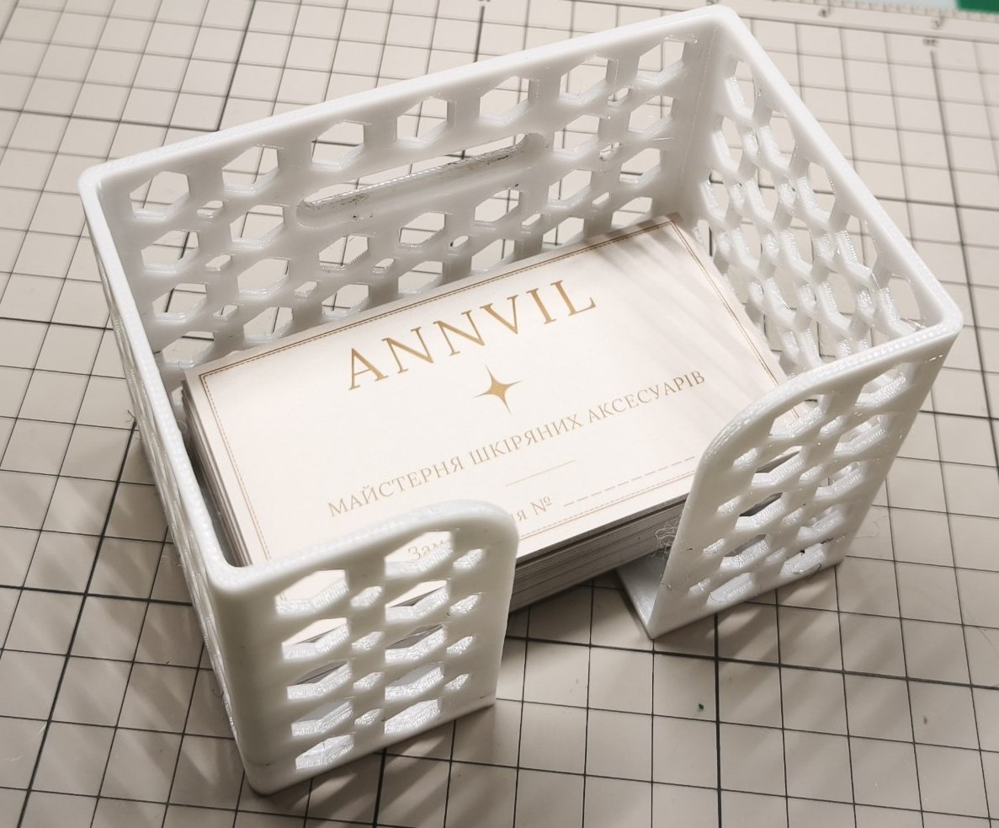
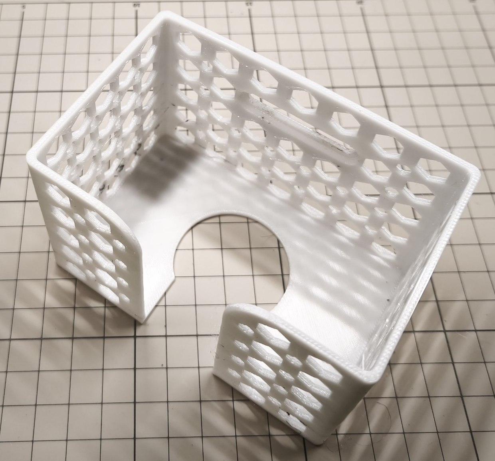
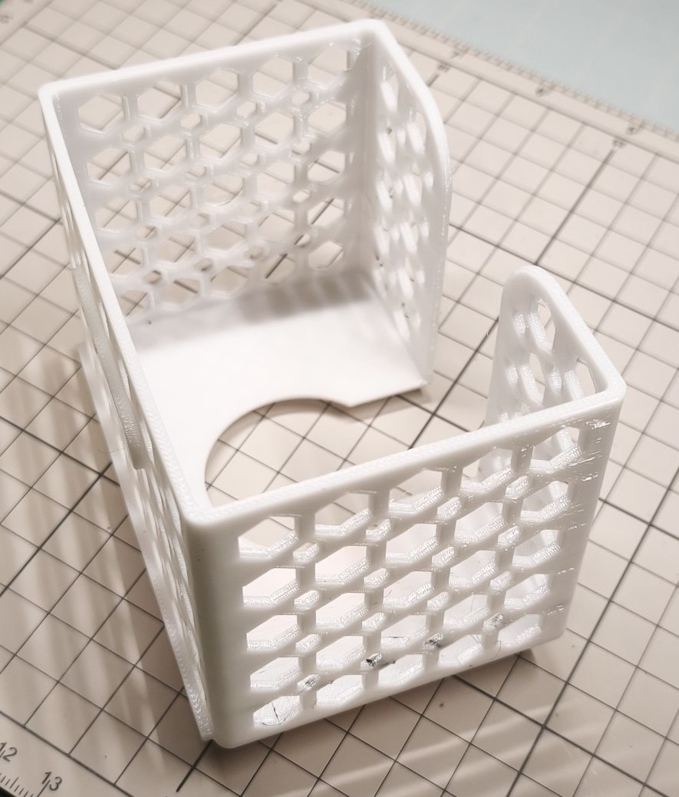
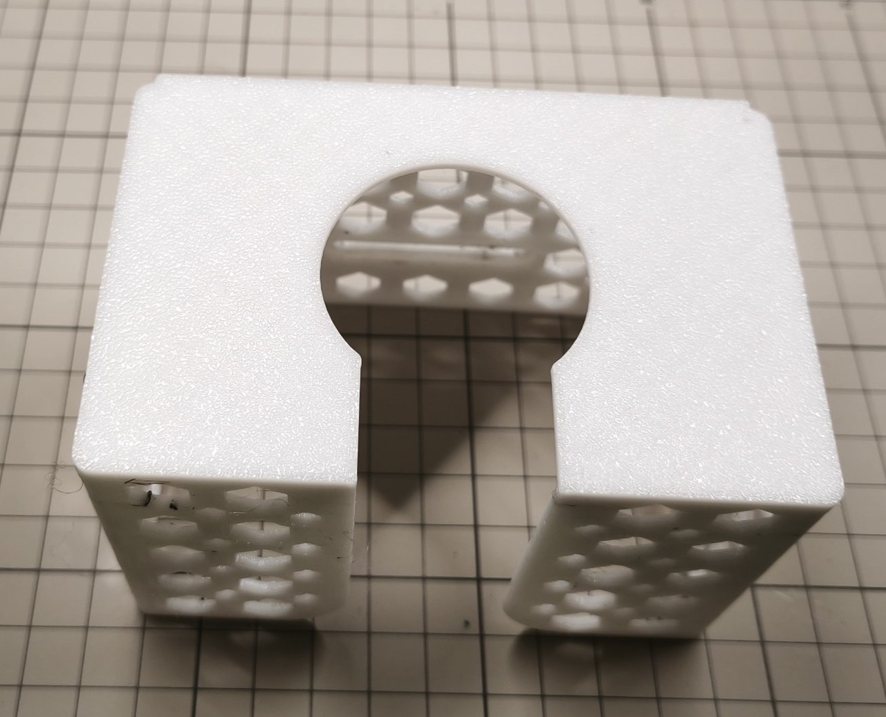
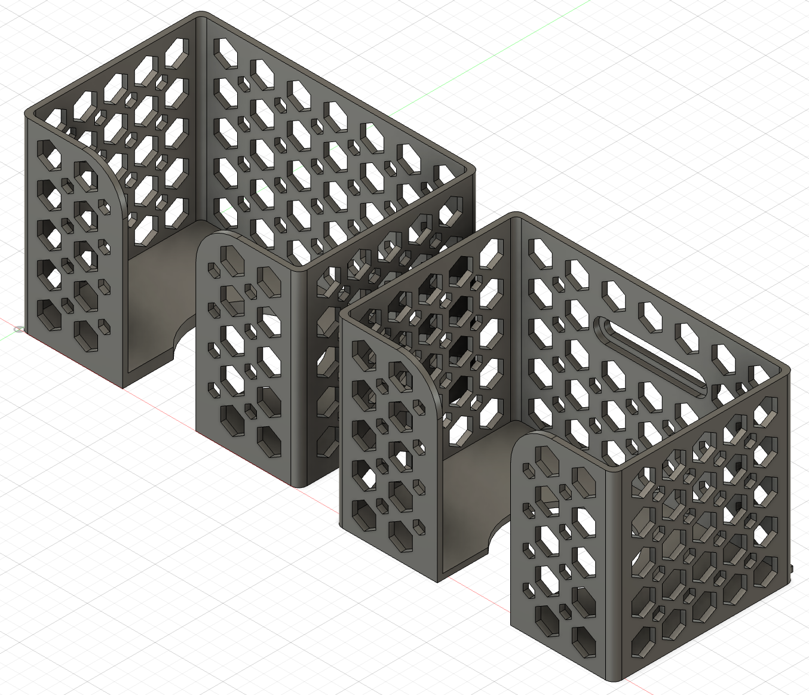
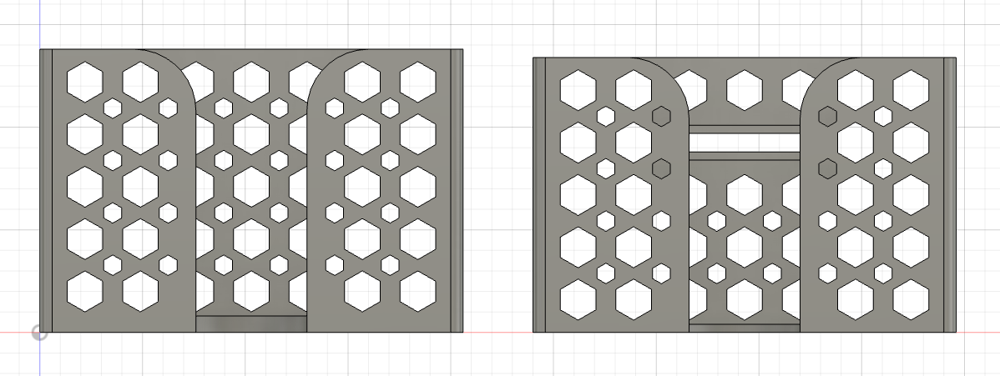
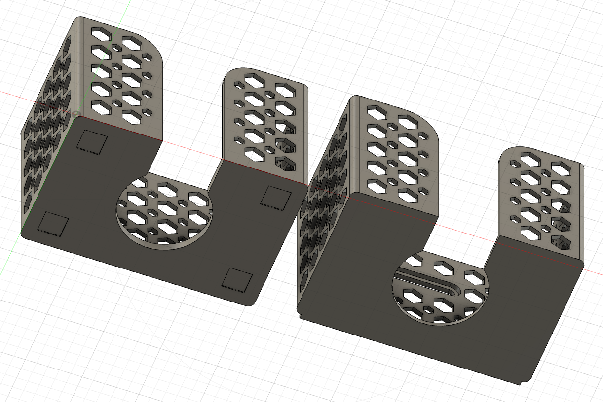
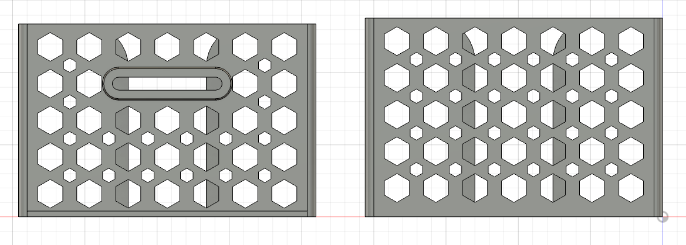

# Business Card Tray

A sleek and functional business card tray featuring a lightweight geometric pattern. Designed to keep your workspace
organized or present your business cards neatly on a wall or desk

- **Two Versions Included**
    - Tabletop: Perfect for desks, counters, or craft fair displays
    - Wall-Mounted: Ideal for vertical display near office entrances or workstations
- **Capacity:** Holds approximately 100–120 standard business cards
- **Easy Access:** Features a front cutout design for quick grabbing and restocking

## Links

- [Headphones Stand on MakerWorld](TODO)
- [Headphones Stand on Printables](TODO)

## Specs

### Tabletop

- **PLA filament:** ~42g
- **Print time:** ~2h

### Wall-mountable

- **PLA filament:** ~40
- **Print time:** ~1h 55min

💡 **Note:** The wall-mountable version designed for M4 screws with a maximum head diameter of 8.5 mm

## Files

- [Bambu Studio .3mf file](business-cards-tray.3mf)
- [Fusion .f3d file](business-cards-tray.f3d)
- [.step file](business-cards-tray.step)

## Preview

### Printed

### 3D

