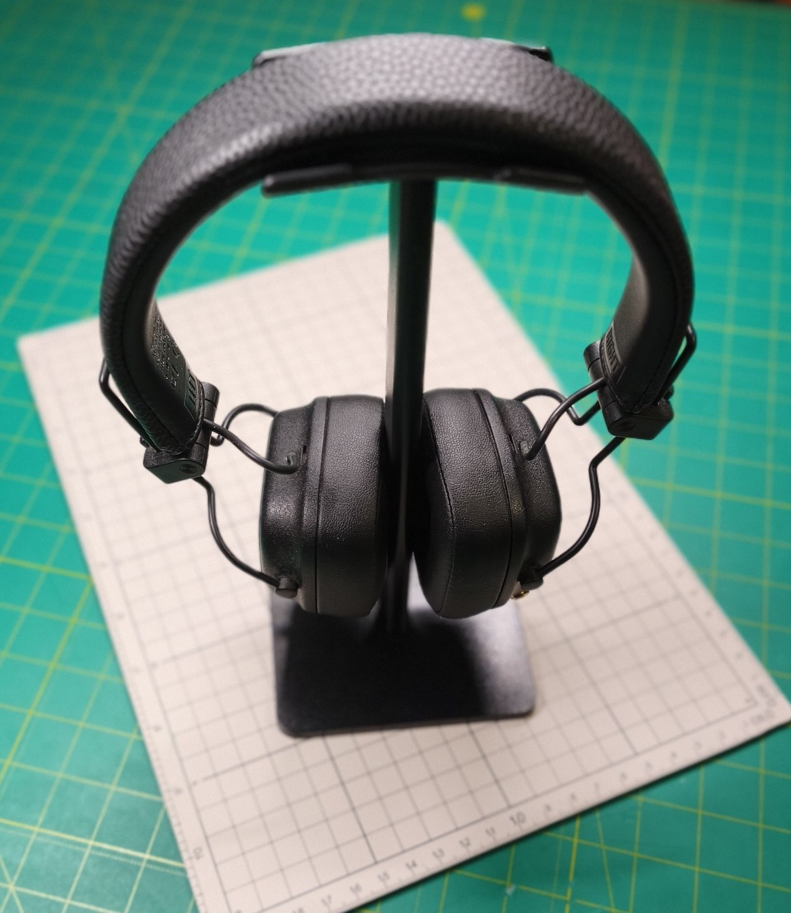
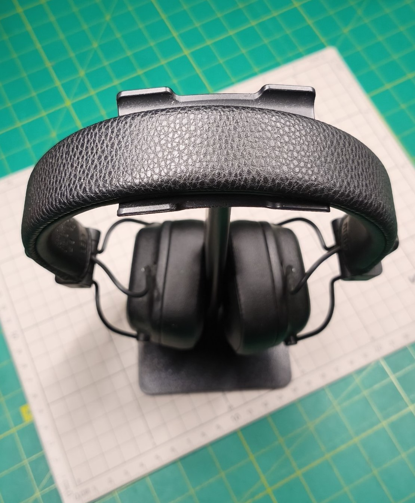
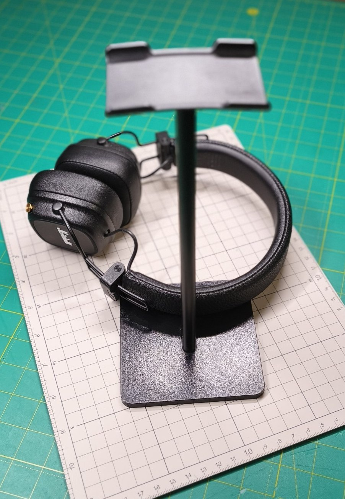
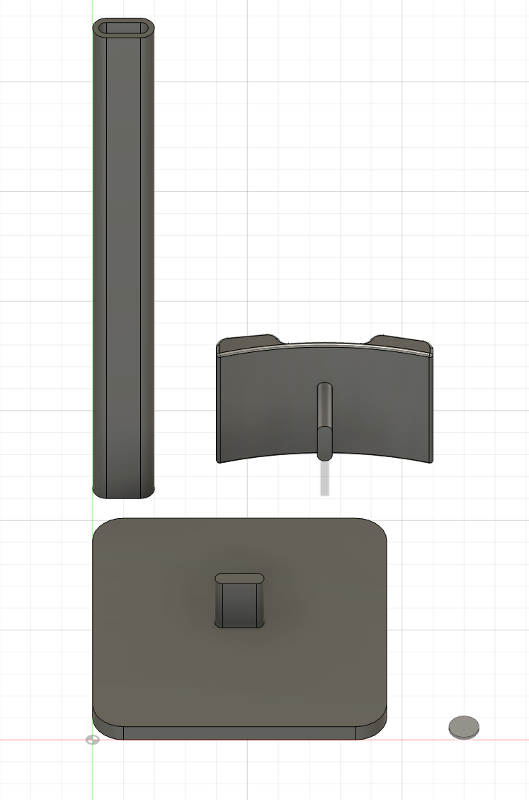
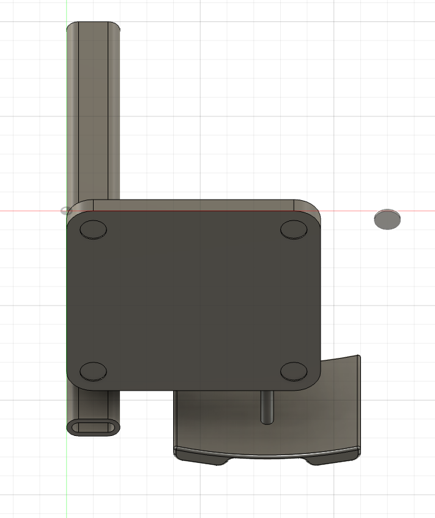
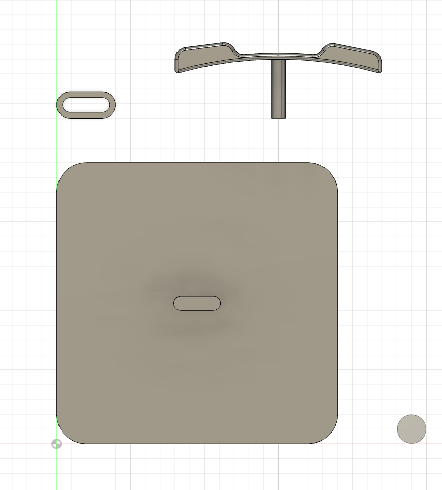

# Headphones Stand

A sleek, functional, no-nonsense headphone stand designed to keep your desk clutter-free

## Links

- [Headphones Stand on MakerWorld](https://makerworld.com/en/models/3010206-headphones-stand#profileId-3380730)
- [Headphones Stand on Printables](https://www.printables.com/model/1771926-headphones-stand)

## Specs

- **PLA filament:** ~70g
- **Print time:** ~3h 40min

💡 **Note:** Depending on the weight of your headphones and your infill settings, the 3D-printed base may feel a
bit light. Consider using double-sided adhesive tape or adding rubber feet to the bottom to keep it rock-solid

## Files

- [Bambu Studio .3mf file](headphones-stand.3mf)
- [Fusion .f3d file](headphones-stand.f3d)
- [.step file](headphones-stand.step)

## Preview

### Printed

### 3D

